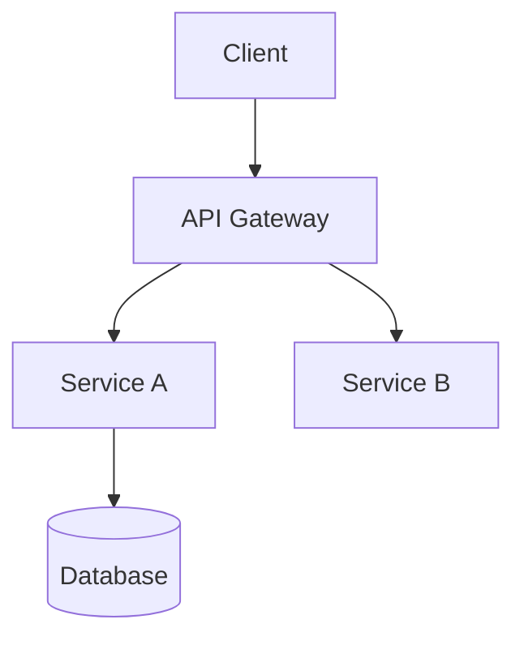

# [Project Name]

> One-line description — what it does and why someone should care.

[Build Status] [Coverage] [Version] [License]

## Overview

2-3 sentences on what the project is and the problem it solves. Who is the
target audience? What makes this different from alternatives?

## Quick Start

The absolute minimum to get running. Copy-paste-able commands that work end
to end. If it takes more than 5 commands or 2 minutes, simplify.

```bash
# Example
npm install
npm start
# Open http://localhost:3000
```

## Installation

Detailed install instructions. Prerequisites first. Per-platform if needed.

### Prerequisites

- Node.js 18+
- PostgreSQL 15+
- Redis 7+ (optional, for caching)

### macOS / Linux

```bash
git clone https://github.com/owner/project.git
cd project
npm install
cp .env.example .env
# Edit .env with your database credentials
npm run db:migrate
npm run dev
```

### Windows

[Windows-specific instructions if different]

## Usage

Common use cases with code examples. Link to full API docs rather than
inlining them.

```javascript
import { Client } from 'project-sdk';

const client = new Client({ apiKey: process.env.API_KEY });
const result = await client.search({ query: 'example' });
console.log(result);
```

## Configuration

All config options with defaults, descriptions, and env var equivalents.

| Option | Default | Description | Env Var |
|--------|---------|-------------|---------|
| `port` | `3000` | HTTP server port | `PORT` |
| `database.url` | — | PostgreSQL connection string | `DATABASE_URL` |
| `redis.url` | — | Redis connection string (optional) | `REDIS_URL` |

## Architecture

High-level description of how components fit together. Link to ADRs for
significant decisions.



## Contributing

How to set up a dev environment, run tests, and submit changes.

```bash
npm test           # Run test suite
npm run lint       # Run linter
npm run build      # Build for production
```

## License

[MIT](LICENSE) — see LICENSE file for details.