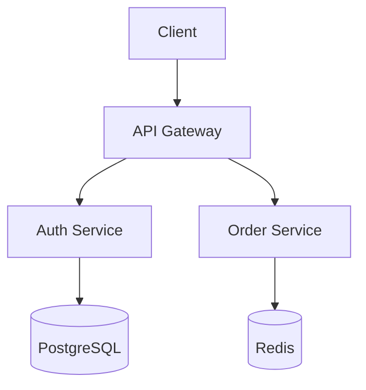

# Markdown Style Guide for Technical Documentation

This guide codifies the Markdown conventions used throughout technical
documentation. Follow these rules to ensure consistent rendering across
GitHub, documentation sites, and AI agent context windows.

---

## Header Hierarchy

- **H1 (`#`)**: One per file — the document title.
- **H2 (`##`)**: Major sections. Use liberally — skimmable docs need headers.
- **H3 (`###`)**: Subsections within a major section.
- **H4-H6**: Use sparingly. If you need H5, consider restructuring.

```markdown
# Document Title

## Section One

### Subsection A

### Subsection B

## Section Two
```

Never use setext-style headers (`===`, `---`).

---

## Paragraphs and Line Breaks

- Separate paragraphs with a blank line.
- Wrap lines at 100 characters (exceptions: URLs, code blocks, tables).
- Use a trailing backslash `\` for a hard line break within a paragraph
  (rarely needed in technical docs).

---

## Emphasis

- **Bold** (`**text**`) for strong emphasis: key terms, UI labels, commands.
- *Italics* (`*text*`) for secondary emphasis: book titles, introduce new
  terms, light stress.
- Never use bold+italics together (`***text***`).
- Never use underscores for emphasis (`_text_`) — use asterisks.

---

## Code

### Inline Code

Use backticks for:
- File names: `config.yaml`
- Commands: `npm install`
- Environment variables: `$DATABASE_URL`
- Code identifiers: `UserService.create()`
- Values: `"active"`

### Code Blocks

- Always specify a language: ` ```python ` not ` ``` `
- Use ` ```text ` for plain text output (logs, CLI output)
- Show commands AND output when demonstrating CLI usage:

````markdown
```bash
$ python main.py --verbose
```
```text
INFO: Starting server on port 8080
```
````

---

## Lists

### Unordered Lists

Use `-` (hyphen) for bullet points. Never use `*` or `+`.

```markdown
- Item one
- Item two
  - Nested item (2-space indent)
  - Another nested item
```

### Ordered Lists

Use `1.` for all items (Markdown auto-numbers):

```markdown
1. First step
1. Second step
1. Third step
```

### Task Lists

Use for checklists and TODOs:

```markdown
- [x] Completed task
- [ ] Pending task
- [ ] Another pending task
```

---

## Links

### Internal Links

Use relative paths for files within the same repository:

```markdown
See the [Authentication Guide](docs/auth.md)
See the [ADR](./docs/adr/0001-decision.md)
```

### External Links

Use absolute URLs:

```markdown
See the [FastAPI documentation](https://fastapi.tiangolo.com/)
```

### Reference-Style Links

Use for repeated URLs to keep prose clean:

```markdown
See the [API docs][api-docs] and the [setup guide][setup].

[api-docs]: https://example.com/api
[setup]: https://example.com/setup
```

### Link Text Rules

- Use descriptive text: "See the [Authentication Guide](auth.md)" not
  "Click [here](auth.md)"
- Don't use raw URLs in prose (exception: footnotes)
- For Discord/Slack: wrap multiple links in `<>` to suppress embeds

---

## Tables

```markdown
| Column A | Column B | Column C |
|----------|:--------:|---------:|
| Left     | Center   |     Right|
| value    | value    |     value|
```

- Use for reference data only, never for layout.
- Keep under 10 columns.
- Align pipes in source for readability.
- Left-align text columns (default), center/right-align numbers as appropriate.

---

## Images

```markdown

```

- Always include meaningful alt text. It's used by screen readers and
  displayed when images fail to load.
- Prefer diagrams rendered as text (Mermaid) over static images when possible.
- If you must use screenshots, re-capture them when the UI changes.

---

## Blockquotes

```markdown
> This is a blockquote.
>
> Multiple paragraphs need a `>` on the blank line too.
```

Use blockquotes for:
- Callouts and notes
- Quoting external sources
- Highlighting important caveats

---

## Horizontal Rules

Use `---` on its own line, surrounded by blank lines:

```markdown
Section one content.

---

Section two content.
```

Use sparingly. Headers are usually a better separator.

---

## HTML in Markdown

Avoid raw HTML in Markdown files. Exceptions:
- `<details><summary>` for collapsible sections (GitHub)
- `<kbd>` for keyboard shortcuts: `<kbd>Ctrl</kbd>+<kbd>C</kbd>`
- `<sup>` / `<sub>` for superscript/subscript
- `<br>` for line breaks within table cells (last resort)

---

## Mermaid Diagrams

Prefer Mermaid for diagrams (renders natively on GitHub, version-controllable):

````markdown

````

Supported diagram types: `graph`, `sequenceDiagram`, `classDiagram`,
`stateDiagram`, `erDiagram`, `gantt`, `pie`, `flowchart`.

---

## Frontmatter

YAML frontmatter at the top of `.md` files:

```markdown
---
title: Document Title
date: 2026-06-23
status: draft
---
```

Separate from content with `---` before and after.

---

## Common Mistakes

| ❌ Wrong | ✅ Correct |
|----------|-----------|
| `#Title` (no space) | `# Title` |
| `-item` (no space) | `- item` |
| No blank line before list | Blank line before list |
| `[click here](url)` | `[descriptive text](url)` |
| ` ``` ` (no language) | ` ```python ` |
| `***bold italic***` | `**bold** *italic*` |
| `_emphasis_` | `*emphasis*` |
| Raw URLs in prose | Linked text or reference-style |

---

*Last updated: 2026-06-23*